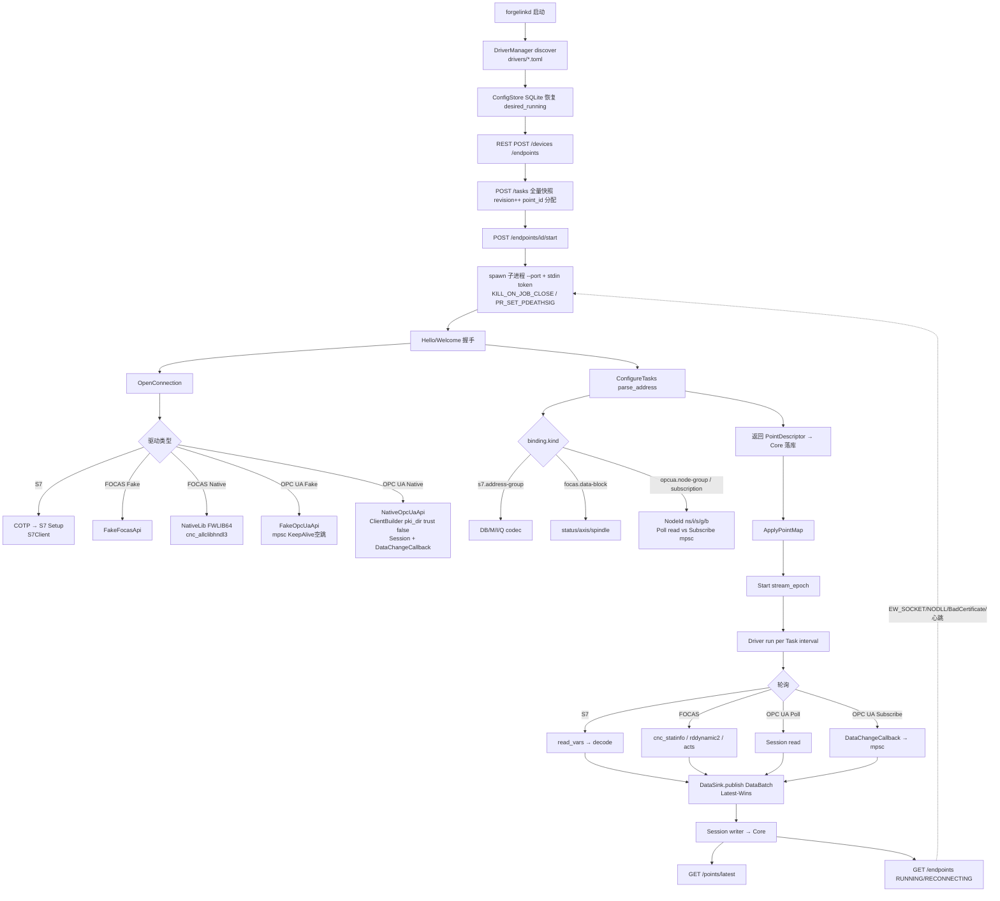

# ForgeLink 统一流程图（S7 / FOCAS2 / OPC UA）

> VS Code 安装 `Markdown Preview Mermaid Support` 后可直接预览；或在 https://mermaid.live 粘贴查看。
> 控制台请看下方 ASCII 或 `docs/flowchart.txt`

```mermaid
flowchart TD
  A[forgelinkd 启动] --> B[DriverManager discover<br/>drivers/*.toml]
  B --> C[ConfigStore SQLite 恢复 desired_running]
  C --> D[REST POST /devices /endpoints]
  D --> E[POST /tasks 全量快照 revision++ point_id 分配]
  E --> F[POST /endpoints/id/start]
  F --> G[spawn 子进程 --port + stdin token<br/>KILL_ON_JOB_CLOSE / PR_SET_PDEATHSIG]
  G --> H[Hello/Welcome 握手]
  H --> I[OpenConnection]
  I --> I1{驱动类型}
   I1 -->|S7| I_S7[COTP → S7 Setup<br/>S7Client]
   I1 -->|FOCAS Fake| I_FF[FakeFocasApi]
   I1 -->|FOCAS Native| I_FN[NativeLib FWLIB64<br/>cnc_allclibhndl3]
   I1 -->|OPC UA Fake| I_OF[FakeOpcUaApi<br/>mpsc KeepAlive空跳]
   I1 -->|OPC UA Native| I_ON[NativeOpcUaApi<br/>ClientBuilder pki_dir trust false<br/>Session + DataChangeCallback]
   H --> J[ConfigureTasks parse_address]
  J --> J1{binding.kind}
   J1 -->|s7.address-group| J_S7[DB/M/I/Q codec]
   J1 -->|focas.data-block| J_F[status/axis/spindle]
   J1 -->|opcua.node-group / subscription| J_O[NodeId ns/i/s/g/b<br/>Poll read vs Subscribe mpsc]
  J --> K[返回 PointDescriptor → Core 落库]
  K --> L[ApplyPointMap]
  L --> M[Start stream_epoch]
  M --> N[Driver run per Task interval]
  N --> N1{轮询}
   N1 -->|S7| R_S7[read_vars → decode]
   N1 -->|FOCAS| R_F[cnc_statinfo / rddynamic2 / acts]
   N1 -->|OPC UA Poll| R_OP[Session read]
   N1 -->|OPC UA Subscribe| R_OS[DataChangeCallback → mpsc]
   R_S7 --> O
   R_F --> O
   R_OP --> O
   R_OS --> O
  O[DataSink.publish DataBatch<br/>Latest-Wins]
  O --> P[Session writer → Core]
  P --> Q[GET /points/latest]
  P --> R[GET /endpoints RUNNING/RECONNECTING]
   R -.->|EW_SOCKET/NODLL/BadCertificate/心跳| G
```
